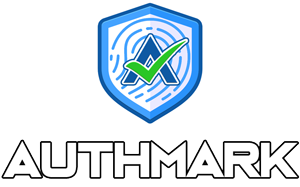

# AuthMark

## dAGI Hackathon Categories

An AI-driven platform using blockchain for secure content verification and immutable records, combating fake news and
malicious synthetic AI media ( deepfakes, voice cloning, disinformation).

## Problems

Detecting Synthetic Content is hard, deepfakes and voice cloning are becoming indistinguishable from real, this are
powering a new wave of sophisticated scams and crimes.

Misinformation and fake news are becoming a global problem, and the current solutions are not enough to stop it.

## Solutions

### 1) Prevention

Adding digital watermarks, trojan horses and "poisoning" the data used to train the AI models can help to detect
synthetic content.

### 2) Detection

Detection of fake content using AI models that can detect the subtle differences between real and synthetic content.

### 3) Authenticity and Ownership and Verification & deAP (Decentralized Authenticity Protocol)

Using blockchain to store the provenance of the content and the reputation of the creator, this can help
to verify the authenticity of the content and the ownership of the content.

### Feature

- AI digital watermarking (methods for video, audio,images and documents)
- Secure font "AuthMarkFont" (digital watermarked fonts)
- Decentralized Proof of Life and Authenticity Protocol (dePoAP)
- Reverse proxy for dynamic content delivery and status updates

Poof of Life:

Chrome Extension:

Proof of Authenticity and deep fake protection for live calls (platform agnostic)

AI Fingerprinting in realtime:

Chrome Extension alerts when webpage has know misinformation

## Pitch

[authmark.org/pitch](http://authmark.org/pitch)

## PoC Demo

[authmark.org/demos](http://authmark.org)

