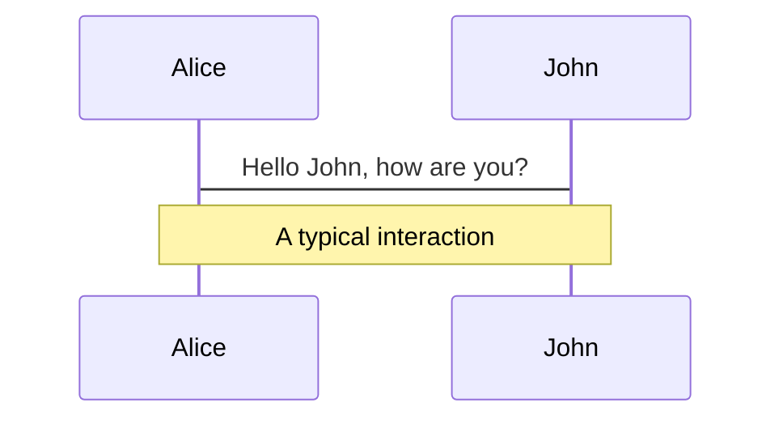
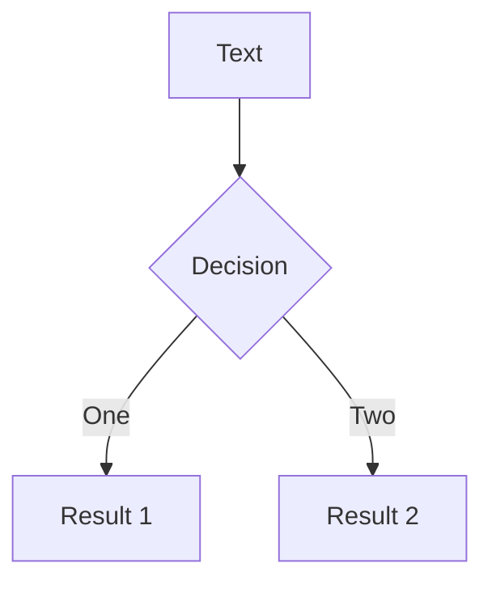
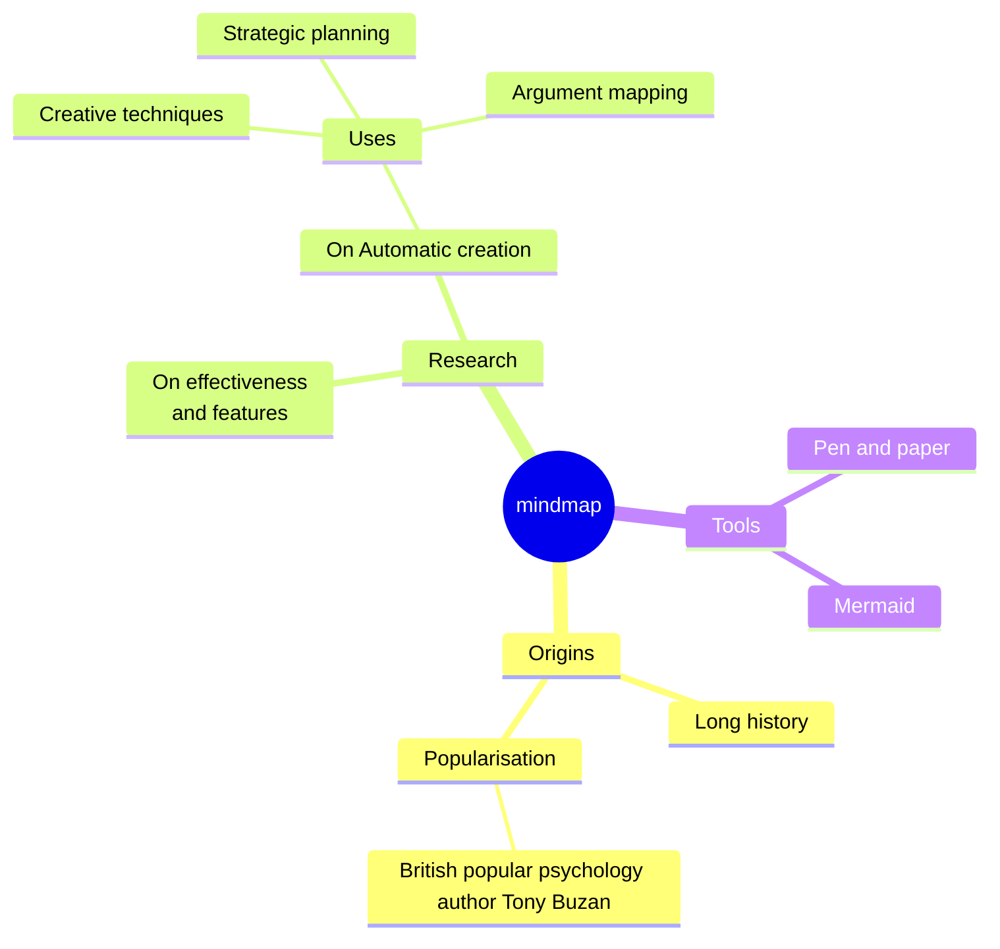
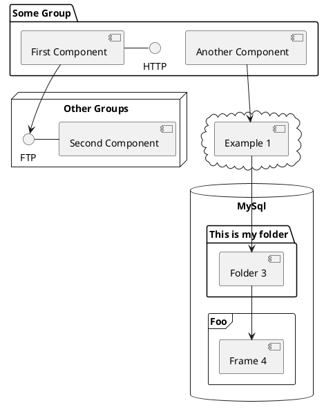

---
# You can also start simply with 'default'
theme: default
# random image from a curated Unsplash collection by Anthony
# like them? see https://unsplash.com/collections/94734566/slidev
background: bg.png
# some information about your slides (markdown enabled)
title: Welcome to AuthMark
info: |
  ## AuthMark
  Protecting citizens and business against malicious AGI (deepfakes, voice cloning, disinformation).
# apply unocss classes to the current slide
class: text-center
# slide transition: https://sli.dev/guide/animations#slide-transitions
transition: slide-left
# enable MDC Syntax: https://sli.dev/guide/syntax#mdc-syntax
mdc: true
contextMenu: false
---

   

 

<h4>Decentralized Proof of Life & Proof of Authenticity Protocol
          to protecting against malicious AI</h4>

  
    Press Space for next page <carbon:arrow-right class="inline"/>
  

    {{ $slidev.nav.currentPage }} / {{ $slidev.nav.total }}
    
      <carbon:chevron-right class="inline" />
    

<template>

  
<a href="https://authmark.org" target="_blank">AuthMark.org</a>

</template>

<!--
The last comment block of each slide will be treated as slide notes. It will be visible and editable in Presenter Mode along with the slide. [Read more in the docs](https://sli.dev/guide/syntax.html#notes)
-->

---
transition: fade-out
---

 
<h3 class=text-center>
Deep fakes / synthetic videos  and voice cloning will soon be impossible to distinguish from real humans.</h3>

   

 

    <a href="https://authmark.org" target="_blank">AuthMark.org</a>
  

      
      <carbon:chevron-left class="inline" />
    
    {{ $slidev.nav.currentPage }} / {{ $slidev.nav.total }}
    
      <carbon:chevron-right class="inline" />
    

<!--
You can have `style` tag in markdown to override the style for the current page.
Learn more: https://sli.dev/guide/syntax#embedded-styles
-->

---
transition: fade-out
---

  
Imagine receiving a call from a loved one, only to find out it was a deep fake / voice clone, tricking you into sending a criminal money.

  

  
Or a trusted business partner sending you a deep fake video of a meeting, causing you to make a decision that costs your
company millions.

    <a href="https://authmark.org" target="_blank">AuthMark.org</a>
  

      
      <carbon:chevron-left class="inline" />
    
    {{ $slidev.nav.currentPage }} / {{ $slidev.nav.total }}
    
      <carbon:chevron-right class="inline" />
    

---
transition: fade-out
---

 
<h3 class=text-center>Cybercrime will cost $10.5 trillion globally by the end of 2025</h3>

   

<h3 class=text-center>
Everday citizens & businesses are ill-prepared against the new wave AI crime</h3>

    <a href="https://authmark.org" target="_blank">AuthMark.org</a>
  

      
      <carbon:chevron-left class="inline" />
    
    {{ $slidev.nav.currentPage }} / {{ $slidev.nav.total }}
    
      <carbon:chevron-right class="inline" />
    

<!--
You can have `style` tag in markdown to override the style for the current page.
Learn more: https://sli.dev/guide/syntax#embedded-styles
-->

---
layout: image-right
image: /problem.png
transition: fade-out
---

# Problems

- Deep fakes and voice cloning are becoming indistinguishable from real, no easy way to verify
- No easy way to verify authenticity of information (misinformation)
- Protecting copyrighted material from digital fraud such as (recent school exam leaks) or company PR & confidential
  docs leaks

      
      <carbon:chevron-left class="inline" />
    
    {{ $slidev.nav.currentPage }} / {{ $slidev.nav.total }}
    
      <carbon:chevron-right class="inline" />
    

---
transition: fade-out
---

# Solution Overview

1) Protection

   - AI models to generate Digital watermarking /poisoning using Allora for ongoing iterations & collaborative improvements

2) Detection

   - AI models to detect synthetic content using Allora for ongoing iterations & collaborative improvements
   - Centralized aggregate of verified misinformation
       - x/twitter notes
       - British Broadcasting Corporation (BBC Verify)

3) Proof of Authenticity and Ownership

   - AI digital watermarking
   - Secure font "AuthMarkFont" (digital watermarked fonts)
   - Decentralized Proof of Life and Authenticity Protocol (dePoAP)

      
      <carbon:chevron-left class="inline" />
    
    {{ $slidev.nav.currentPage }} / {{ $slidev.nav.total }}
    
      <carbon:chevron-right class="inline" />
    

---
transition: fade-out
---

# Motion

Motion animations are powered by [@vueuse/motion](https://motion.vueuse.org/), triggered by `v-motion` directive.

  

    
    
    
  

  

    Slidev
  

    <a href="https://authmark.org" target="_blank">AuthMark.org</a>
  
p

      
      <carbon:chevron-left class="inline" />
    
    {{ $slidev.nav.currentPage }} / {{ $slidev.nav.total }}
    
      <carbon:chevron-right class="inline" />
    

<!-- vue script setup scripts can be directly used in markdown, and will only affects current page -->

[Learn More](https://sli.dev/guide/animations.html#motion)

---
layout: image-right
image: /VoiceCloning.jpg
---

### Deep Fakes & Voice Cloning

text...

    <a href="https://authmark.org" target="_blank">AuthMark.org</a>
  

      
      <carbon:chevron-left class="inline" />
    
    {{ $slidev.nav.currentPage }} / {{ $slidev.nav.total }}
    
      <carbon:chevron-right class="inline" />
    

---

# Diagrams

You can create diagrams / graphs from textual descriptions, directly in your Markdown.

[Learn More](https://sli.dev/guide/syntax.html#diagrams)

    <a href="https://authmark.org" target="_blank">AuthMark.org</a>
  

      
      <carbon:chevron-left class="inline" />
    
    {{ $slidev.nav.currentPage }} / {{ $slidev.nav.total }}
    
      <carbon:chevron-right class="inline" />
    

---

<!-- 
Vision 
-->

    <a href="https://authmark.org" target="_blank">AuthMark.org</a>
  

## Vision

Just like firewalls ans antivirus software, protection against synthetic ai threats &/ verifying inofrmations (mis/dis)
Authmark is positioned to be a must have tool for the future from individuals to big businesses.

   

We believe in free speech and privacy therefore authenticating Proof if life, voice and deepfakes should be
decentralised and user owned not by big tech.

      
      <carbon:chevron-left class="inline" />
    
    {{ $slidev.nav.currentPage }} / {{ $slidev.nav.total }}

---
layout: center
class: text-center
---

   

 
AI powered Authenticity & Protection from AI threats, for citizens and businesses

 
<h3 class="pa-5"><a href="https://authmark.org" target="_blank">AuthMark.org</a></h3>

[PoC Demo](https://AuthMark.org/demo)  · [GitHub](https://github.com/AuthMark)

      
      <carbon:chevron-left class="inline" />
    
    {{ $slidev.nav.currentPage }} / {{ $slidev.nav.total }}

  

